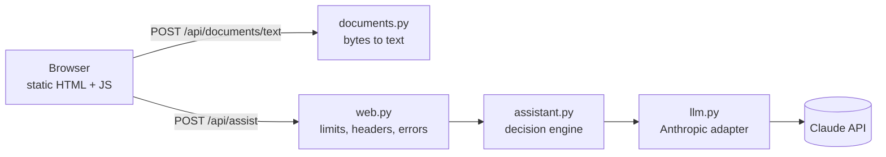

# FinePrint

FinePrint explains legal documents in plain language. Paste or upload a lease, employment
contract, freelance agreement, NDA or terms of service and it tells you what the document
says, which clauses deserve attention and why, what is missing, and what to ask a lawyer.
It can also compare two documents and answer questions about them. Every quote it shows
is checked against your document by ordinary code, so you can click through to the exact
passage.

It gives information about a text, not legal advice, and says so on every result.

## Challenge

Prompt War, legal vertical: *make legal information and basic legal assistance more
accessible by helping users understand, compare, and navigate legal documents.*

## Problem

People sign contracts they do not fully understand because reading one properly takes
hours and a lawyer costs money. The failure modes of a naive AI answer make it worse:
confident summaries that miss the one clause that matters, "quotes" the document never
contained, advice written for the wrong party, and so many hedges that nothing is useful.

## Solution

A small local web app with three tasks, chosen automatically from what you provide:

| You provide | Task | You get |
|---|---|---|
| One document | **Analyze** | Who it is written for, summary, risky or unusual clauses ranked by severity (with why each matters), key terms, obligations per party, what is missing or unclear, questions for a lawyer, next steps including your options |
| A question (one or two documents) | **Ask** | A direct answer, whether the document supports it (yes, partly, no), supporting quotes and caveats |
| Two documents | **Compare** | Differences by topic: what each says, what it means for you, severity, quotes from both |

Three design choices do most of the work:

- **Grounding is verified in code, not trusted.** The model must quote the document. Each
  quote is matched against the document it names, tolerant of PDF artefacts (line breaks,
  hyphenation, ligatures, curly quotes) but not of changed words or numbers. Matched quotes
  are replaced with the exact source passage. Unmatched ones are removed and flagged.
- **The user's side of the deal is explicit.** The optional "Your situation" field sets the
  perspective. When it is empty, the assessment is written for the individual or less
  powerful party and says so ("Assessed for: the Tenant").
- **The text the model sees is the text you see.** Extracted text lands in an editable
  textarea, so bad extraction or hidden text in a PDF is visible before anything is sent.

## Architecture



| Module | Responsibility |
|---|---|
| `fineprint/documents.py` | PDF, DOCX, TXT and MD to text. Bounded parsing; every failure becomes a `DocumentError` with a user-facing message. |
| `fineprint/schemas.py` | Request, response and model-output shapes. Output models double as the JSON schema sent to the model. |
| `fineprint/prompts.py` | The system prompt and the per-task instructions. |
| `fineprint/assistant.py` | Task selection, quote verification, severity ordering, warnings, disclaimer. Pure logic, no I/O. |
| `fineprint/llm.py` | The only code that talks to the API. Returns a validated object or an `LLMError`. |
| `fineprint/web.py` | FastAPI app factory: routes, request limits, security headers, error mapping. |
| `fineprint/static/` | The single-page UI. No framework, no build step. |

The app is stateless. Extracted text goes back to the browser and is sent again with each
request, so there are no sessions, temporary files or stored documents.

Endpoints (the interactive API docs are disabled because the CSP blocks their CDN assets):

- `POST /api/documents/text?kind=pdf|docx|txt|md` takes the raw file as the request body and returns `{"text": "..."}`.
- `POST /api/assist` takes `{"documents": ["..."], "question": "...", "context": "..."}` and returns `{"task", "result", "warnings", "disclaimer"}`.
- Errors always return `{"detail": "..."}`.

## Decision logic

```text
Input       documents (1-2), optional question, optional situation
Validation  pydantic: 1-2 non-blank documents, each <= 300,000 characters; question <= 1,000; situation <= 500
Decision    question present -> ask; two documents -> compare; otherwise -> analyze        (code)
Action      one structured-output call: documents as cached document blocks + task instructions
Checks      stop_reason: refusal -> declined, max_tokens -> truncated                     (code)
            output must validate against the task's schema, otherwise malformed          (code)
            every quote verified against its named document; unmatched quotes blanked   (code)
            risks and differences sorted high, medium, low                               (code)
Result      result + deterministic warnings + fixed disclaimer
```

The model is used only for what needs language understanding: reading the document,
judging what matters and explaining it. Everything checkable is checked by code, and each
warning comes from code, not from the model:

- **Unmatched points.** Some points could not be matched to a passage in the document. This covers quotes that were not found and findings that had no quote at all.
- **Not a legal document.** The text does not look like a legal document.
- **Uncited answer.** An answer claims support from the document but cites no passage that could be found.

## Key features

How each use case listed in the challenge maps to the app:

| Challenge use case | Where it lives |
|---|---|
| Simplify complex legal documents | Analyze: `summary`, `plain_language` for every risk |
| Compare contracts, agreements, policies | Compare: `differences` with what each document says and the impact |
| Highlight clauses, obligations, risks, inconsistencies | Analyze: `risks` (contradictory clauses count as risks), `obligations`, `key_terms` |
| Answer questions from the documents | Ask: `answer`, `supported_by_document`, verified `quotes`, `caveats` |
| Understand options and next steps | Analyze: `next_steps`, which includes your choices |
| Summaries, checklists, actionable outputs | Every result; "Copy results" or print to PDF |
| Prepare for a legal professional | `questions_for_lawyer`, each naming the clause concerned |

Also included:

- A must-check list of clause types (termination, auto-renewal, liability, IP, non-compete, arbitration and more). Anything expected but absent is reported as missing.
- Schedules and exhibits that are referenced but not included are reported as missing.
- Partly scanned PDFs are marked page by page instead of silently losing pages.
- "Show in document" selects the quoted passage in your text.
- Follow-up questions keep the analysis on screen.

## Accessibility

- Semantic HTML with a real `<form>`, a `<label>` for every control, fieldsets and a heading hierarchy. Hints are part of the label text, so screen readers announce them.
- Status updates go to a `role="status"` region and errors to a `role="alert"` region. Focus moves to the new results or answer heading.
- Severity is written as text ("High") as well as shown in colour. Every colour pair meets WCAG AA contrast (at least 4.5:1) in light and dark mode (`color-scheme: light dark`).
- Everything works from the keyboard, with a visible focus outline and no animations. The layout works at phone width.

## Tech stack

- Python 3.11+, [uv](https://docs.astral.sh/uv/)
- FastAPI (Starlette, uvicorn) for the web layer
- Anthropic Python SDK. The model defaults to `claude-opus-5`.
- pypdf (with `cryptography` for encrypted PDFs); DOCX is parsed with the standard library
- pytest and ruff
- Plain HTML, CSS and JavaScript for the UI

## Setup

Requires Python 3.11+ and uv.

```bash
git clone <this repository> fineprint
cd fineprint
uv sync
cp .env.example .env
```

On Windows, use `copy .env.example .env` for the last step. Then put your Anthropic API key in `.env` and start the app:

```bash
uv run --env-file .env uvicorn --factory fineprint.web:create_app
```

Open <http://localhost:8000>. For development, add `--reload`.

## Configuration

| Variable | Required | Default | Purpose |
|---|---|---|---|
| `ANTHROPIC_API_KEY` | Yes, unless you use `ant auth login` | none | Credentials for the Claude API |
| `ANTHROPIC_MODEL` | No | `claude-opus-5` | Model used for all tasks |

The SDK's standard credential chain applies: `ANTHROPIC_API_KEY`, then
`ANTHROPIC_AUTH_TOKEN`, then an `ant auth login` profile. If none is found, the app refuses
to start and says what to do. Upload and document size limits are constants in
`web.py` and `documents.py`.

## Usage

1. Upload `samples/agreement-v1.txt`, a freelance agreement with several one-sided clauses. You can also paste the text.
2. Optionally write your situation, for example "I'm the freelancer, signing next week".
3. Leave the question blank and press **Get help with this document**.

Expect the analysis to flag the worldwide 24-month non-compete, the unlimited liability, the
assignment of your pre-existing work and the one-sided termination rights. It should also
report that Schedule A (the fees) is referenced but missing, and give questions to ask a
lawyer and next steps.

4. Ask a follow-up, such as "Can I leave early?". The answer is added below the analysis.
5. Open **Compare with a second document**, add `samples/agreement-v2.txt` and submit with no question. You get a topic-by-topic comparison of the two drafts.

## Testing

```bash
uv sync --extra dev
uv run pytest
uv run ruff check .
uv run ruff format --check .
```

The suite runs offline in about two seconds. The model is replaced by a fake at the
`LLMClient` protocol, and the SDK client by a mock inside the adapter tests. Test PDFs and
DOCX files are built inside the tests, so there are no binary fixtures.

| File | What it covers |
|---|---|
| `test_documents.py` | Encodings (UTF-8, BOM, UTF-16, cp1252), DOCX paragraphs and zip-bomb bound, PDF text, scanned and partly scanned PDFs, encrypted PDFs, corrupt files, size limits |
| `test_assistant.py` | Task selection, request validation, quote verification (PDF artefacts, altered amounts, empty and wrongly labelled quotes, evidence-free findings), prompt assembly and caching, severity order, warnings |
| `test_llm.py` | Stop reason checked before parsing, malformed output not logged, HTTP status to error-code mapping, missing credentials |
| `test_web.py` | Routes, upload handling, 413, host check, security headers, validation errors that never echo the document, model failures as fixed messages |

A manual check needs a real key. Run all three tasks on `samples/`, then ask two
questions in a row. The second request's log line should show `cache_read_tokens` above 0.

## Assumptions

- Users are non-lawyers reading one or two documents at a time on their own machine.
- A document fits in the model's context (up to 300,000 characters, about 75,000 tokens), so there is no chunking or retrieval.
- When the user does not say which party they are, the individual or less powerful party is the safer default.
- The UI is in English; the model answers in the language of the question or document.

## Trade-offs

- **Quote verification instead of API citations.** The API's citations feature cannot be combined with structured outputs. Matching quotes in code keeps both: typed results and verifiable evidence. The cost is a tolerant matcher that trims edge punctuation from the passages it returns.
- **Structured output through `output_config`, not the SDK's `output_format` helper.** The helper parses the response before the stop reason is known. Parsing after the check means a truncated or refused response can never be shown as a complete result.
- **One large-model call per task.** Accuracy matters more than cost here. Prompt caching makes repeated questions on the same document cheaper. The schema is part of the cached prefix, so the first question after an analysis is still a cache write.
- **No refusal fallback model.** Legal text rarely triggers safety classifiers. A refusal is shown as a clear error instead of being silently retried on another model.
- **Stateless over convenient.** Nothing is stored, so there is nothing to leak or clean up. The cost is that the browser sends the document text with every request.

## Limitations

- It explains the text; it does not know your jurisdiction's law, case law or your negotiating position, and it can be wrong.
- Quotes are verified; summaries, explanations and severities are not. A document's author could craft text that influences them. Treat the output as a reading aid.
- Scanned PDFs are not supported (no OCR). Pages without a text layer are marked.
- Legacy `.doc`, `.rtf` and other formats must be pasted as text.
- A request cannot be cancelled once sent; long documents can take a few minutes.
- The UI text is English only.

## Security

- **Secrets.** The API key comes from the environment and is never logged. `.env` is gitignored, and startup fails clearly without credentials.
- **Untrusted files.** DOCX decompression is capped against zip bombs, PDF extraction stops at the character limit, and request bodies over 10 MB are rejected before they are read. Any parser failure becomes a 400 with a fixed message.
- **Untrusted model output.** The output is schema-validated, its stop reason is checked first, its quotes are verified, and it is rendered with `textContent` only, never as HTML.
- **Prompt injection.** The system prompt treats document text as material, not instructions, and the output schema is fixed. This reduces the risk but cannot eliminate it, which is why extracted text is shown to the user and quotes are verified.
- **Privacy in logs and errors.** Logs hold sizes, durations, token counts and request ids, never document text, questions or file names. Validation errors are rebuilt from field names so they never echo the submitted document.
- **Local-only by design.** The app binds to localhost, rejects other `Host` headers (a DNS-rebinding guard, because the server spends your API key) and sends a strict CSP, `nosniff` and `no-referrer`.

Before exposing it beyond your own machine, add:

- authentication
- per-user rate limiting and uvicorn's `--limit-concurrency`
- HTTPS
- your hostname in `ALLOWED_HOSTS`
