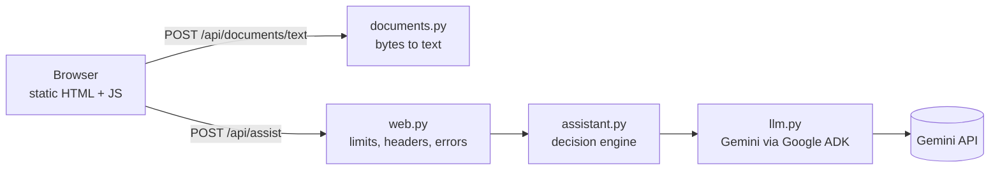

# FinePrint

FinePrint explains legal documents in plain language. Paste or upload a lease, employment
contract, freelance agreement, NDA or terms of service and it tells you what the document
says, which clauses deserve attention and why, what is missing, and what to ask a lawyer.
It can also compare two documents and answer questions about them. Every quote it shows
is checked against your document by ordinary code, so you can click through to the exact
passage.

It gives information about a text, not legal advice, and says so on every result.

**Live demo:** <https://fineprint-1056761597541.asia-south1.run.app> (Google Cloud Run). The
samples in [`samples/`](samples/) are a good first try.

## Challenge

Prompt War, legal vertical: *make legal information and basic legal assistance more
accessible by helping users understand, compare, and navigate legal documents.*

## Problem

People sign contracts they do not fully understand because reading one properly takes
hours and a lawyer costs money. The failure modes of a naive AI answer make it worse:
confident summaries that miss the one clause that matters, "quotes" the document never
contained, advice written for the wrong party, and so many hedges that nothing is useful.

## Solution

A small local web app with three tasks, chosen automatically from what you provide:

| You provide | Task | You get |
|---|---|---|
| One document | **Analyze** | Who it is written for, summary, risky or unusual clauses ranked by severity (with why each matters), key terms, obligations per party, what is missing or unclear, questions for a lawyer, next steps including your options |
| A question (one or two documents) | **Ask** | A direct answer, whether the document supports it (yes, partly, no), supporting quotes and caveats |
| Two documents | **Compare** | Differences by topic: what each says, what it means for you, severity, quotes from both |

Three design choices do most of the work:

- **Grounding is verified in code, not trusted.** The model must quote the document. Each
  quote is matched against the document it names. Matching ignores spacing, punctuation and
  PDF artefacts (line breaks, hyphenation, ligatures, curly quotes) but not changed letters,
  digits, or currency and percent signs. A matched quote is always replaced with the exact
  source passage, so what you see is what the document says. Unmatched quotes are removed
  and flagged.
- **The user's side of the deal is explicit.** The optional "Your situation" field sets the
  perspective. When it is empty, the assessment is written for the individual or less
  powerful party and says so ("Assessed for: the Tenant").
- **The text the model sees is the text you see.** Extracted text lands in an editable
  textarea, so bad extraction or hidden text in a PDF is visible before anything is sent.

## Architecture



| Module | Responsibility |
|---|---|
| `fineprint/documents.py` | PDF, DOCX, TXT and MD to text. Bounded parsing; every failure becomes a `DocumentError` with a user-facing message. |
| `fineprint/schemas.py` | Request, response and model-output shapes. Output models double as the JSON schema sent to the model. |
| `fineprint/prompts.py` | The system prompt and the per-task instructions. |
| `fineprint/assistant.py` | Task selection, quote verification, severity ordering, warnings, disclaimer. Pure logic, no I/O. |
| `fineprint/llm.py` | The only code that talks to the model: Gemini, driven through Google's Agent Development Kit (ADK). Returns a validated object or an `LLMError`. |
| `fineprint/web.py` | FastAPI app factory: routes, request limits, security headers, error mapping. |
| `fineprint/static/` | The single-page UI. No framework, no build step. |

The app is stateless. Extracted text goes back to the browser and is sent again with each
request, so there are no sessions, temporary files or stored documents.

Endpoints (the interactive API docs are disabled because the CSP blocks their CDN assets):

- `POST /api/documents/text?kind=pdf|docx|txt|md` takes the raw file as the request body and returns `{"text": "..."}`.
- `POST /api/assist` takes `{"documents": ["..."], "question": "...", "context": "..."}` and returns `{"task", "result", "warnings", "disclaimer"}`.
- Errors return `{"detail": "..."}`. The two exceptions come from middleware as plain text: the 10 MB body-limit 413 and the host-check 400.

## Decision logic

```text
Input       documents (1-2), optional question, optional situation
Validation  pydantic: 1-2 non-blank documents, each <= 300,000 characters; question <= 1,000; situation <= 500
Decision    question present -> ask; two documents -> compare; otherwise -> analyze        (code)
Action      one ADK agent run with a response schema: labelled documents + task instructions
Checks      finish reason: MAX_TOKENS -> truncated, blocked or any other stop -> declined  (code)
            output must validate against the task's schema, otherwise malformed          (code)
            every quote verified against its named document; unmatched quotes blanked   (code)
            risks and differences sorted high, medium, low                               (code)
Result      result + deterministic warnings + fixed disclaimer
```

The model is used only for what needs language understanding: reading the document,
judging what matters and explaining it. Everything checkable is checked by code, and each
warning comes from code, not from the model:

- **Unmatched points.** Some points could not be matched to a passage in the document. This covers quotes that were not found and findings that had no quote at all.
- **Not a legal document.** The text does not look like a legal document.
- **Uncited answer.** An answer claims support from the document but cites no passage that could be found.

## Key features

How each use case listed in the challenge maps to the app:

| Challenge use case | Where it lives |
|---|---|
| Simplify complex legal documents | Analyze: `summary`, `plain_language` for every risk |
| Compare contracts, agreements, policies | Compare: `differences` with what each document says and the impact |
| Highlight clauses, obligations, risks, inconsistencies | Analyze: `risks` (contradictory clauses count as risks), `obligations`, `key_terms` |
| Answer questions from the documents | Ask: `answer`, `supported_by_document`, verified `quotes`, `caveats` |
| Understand options and next steps | Analyze: `next_steps`, which includes your choices |
| Summaries, checklists, actionable outputs | Every result; "Copy results" or print to PDF |
| Prepare for a legal professional | `questions_for_lawyer`, each naming the clause concerned |

Also included:

- A must-check list of clause types (termination, auto-renewal, liability, IP, non-compete, arbitration and more). Anything expected but absent is reported as missing.
- Schedules and exhibits that are referenced but not included are reported as missing.
- Partly scanned PDFs are marked page by page instead of silently losing pages.
- "Show in document" selects the quoted passage in your text.
- Follow-up questions keep the analysis on screen.

## Accessibility

- Semantic HTML with a real `<form>`, a `<label>` for every control, fieldsets and a heading hierarchy. Hints are part of the label text, so screen readers announce them.
- Status updates go to a `role="status"` region and errors to a `role="alert"` region. Focus moves to the new results or answer heading.
- Severity is written as text ("High") as well as shown in colour. Every colour pair meets WCAG AA contrast (at least 4.5:1) in light and dark mode (`color-scheme: light dark`).
- Everything works from the keyboard, with a visible focus outline. The only motion is the browser's own progress bar while a request runs. The layout works at phone width.

## Tech stack

- Python 3.11+, [uv](https://docs.astral.sh/uv/)
- FastAPI (Starlette, uvicorn) for the web layer
- [Google ADK](https://google.github.io/adk-docs/) with Gemini. The model defaults to `gemini-3.5-flash-lite`.
- pypdf (with `cryptography` for encrypted PDFs); DOCX is unzipped with the standard library and parsed with defusedxml
- pytest and ruff
- Plain HTML, CSS and JavaScript for the UI

## Setup

Requires Python 3.11+ and uv.

```bash
git clone <this repository> fineprint
cd fineprint
uv sync
cp .env.example .env
```

On Windows, use `copy .env.example .env` for the last step. Then put your Gemini API key (from [Google AI Studio](https://aistudio.google.com/apikey)) in `.env` and start the app:

```bash
uv run --env-file .env uvicorn --factory fineprint.web:create_app
```

Open <http://localhost:8000>. For development, add `--reload`.

## Configuration

| Variable | Required | Default | Purpose |
|---|---|---|---|
| `GOOGLE_API_KEY` | Yes (`GEMINI_API_KEY` also works) | none | Gemini API key |
| `GEMINI_MODEL` | No | `gemini-3.5-flash-lite` | Model used for all tasks, e.g. `gemini-3.5-flash` or a Pro model for dense contracts |
| `ALLOWED_HOSTS` | When deployed | `localhost,127.0.0.1` | Comma-separated hostnames the app answers to |
| `ASSIST_LIMIT_PER_CLIENT` | No | `20` | Model requests allowed per client per hour |
| `ASSIST_LIMIT_TOTAL` | No | `200` | Model requests allowed per hour across all clients |
| `UPLOAD_LIMIT_PER_CLIENT` | No | `60` | File extractions allowed per client per hour |
| `TRUSTED_PROXY_HOPS` | Behind a proxy | `0` | Proxies in front of the app (`1` on Cloud Run); client addresses are read from that many hops from the right of `X-Forwarded-For` |
| `RESULT_CACHE_SIZE` | No | `128` | Finished answers kept in memory for identical repeat requests (`0` disables) |

If no key is set, the app refuses to start and says what to do. Size limits are constants: the upload limit in `web.py`, the
document limit in `documents.py`, and the question and situation limits in `schemas.py`. The UI
repeats the last two as `maxlength` in `static/index.html` and the upload limit in the 413
message in `static/app.js`, so change them together.

## Deployment

The demo runs on Google Cloud Run from the included `Dockerfile`. To deploy your own copy
(replace `PROJECT`; the region is up to you):

```bash
gcloud iam service-accounts create fineprint-run --project PROJECT
printf '%s' "$GOOGLE_API_KEY" | gcloud secrets create fineprint-gemini-api-key --project PROJECT --data-file=-
gcloud secrets add-iam-policy-binding fineprint-gemini-api-key --project PROJECT \
  --member serviceAccount:fineprint-run@PROJECT.iam.gserviceaccount.com --role roles/secretmanager.secretAccessor
gcloud run deploy fineprint --source . --project PROJECT --region asia-south1 \
  --service-account fineprint-run@PROJECT.iam.gserviceaccount.com \
  --set-secrets GOOGLE_API_KEY=fineprint-gemini-api-key:latest \
  --set-env-vars "^@^ALLOWED_HOSTS=<your service hostnames>@TRUSTED_PROXY_HOPS=1" \
  --allow-unauthenticated --max-instances 1 --concurrency 20 --memory 512Mi --timeout 300
```

Choices behind these flags:

- The key lives in Secret Manager. Only a dedicated service account can read it, so the
  service never runs with the project's broad default identity.
- `--max-instances 1` caps cost, and it keeps the in-memory rate limits meaningful.
- `.dockerignore` and `.gcloudignore` keep `.env` out of both the upload and the image.

## Usage

1. Upload `samples/agreement-v1.txt`, a freelance agreement with several one-sided clauses. You can also paste the text.
2. Optionally write your situation, for example "I'm the freelancer, signing next week".
3. Leave the question blank and press **Get help with this document**.

In a real run with `gemini-3.5-flash-lite` (about 8 seconds), the analysis flagged five
high risks: uncapped liability and indemnity, the worldwide non-compete, the loss of your
pre-existing work and portfolio rights, one-sided scope and payment terms, and one-sided
termination. It rated unilateral changes and the dispute waiver as medium. It also reported
that Schedule A (the fees) and the project brief are referenced but missing. All 20 quotes
matched the document. The full response is in
[`samples/example-analysis.json`](samples/example-analysis.json).

4. Ask a follow-up, such as "Can I leave early?". The answer is added below the analysis.
5. Open **Compare with a second document**, add `samples/agreement-v2.txt` and submit with no question. You get a topic-by-topic comparison of the two drafts, with quotes from each (about 8 seconds).

## Testing

```bash
uv sync --extra dev
uv run pytest
uv run ruff check .
uv run ruff format --check .
```

The suite runs offline in about 15 seconds. The model is replaced by a fake at the
`LLMClient` protocol, and the SDK client by a mock inside the adapter tests. Test PDFs and
DOCX files are built inside the tests, so there are no binary fixtures.

| File | What it covers |
|---|---|
| `test_documents.py` | Encodings (UTF-8, BOM, UTF-16, cp1252), DOCX paragraphs, zip-bomb and XML-entity attacks, PDF text, scanned and partly scanned PDFs, encrypted PDFs, corrupt files, size limits |
| `test_assistant.py` | Task selection, request validation, quote verification (PDF artefacts, altered amounts, empty and wrongly labelled quotes, evidence-free findings), what is sent to the model, severity order, warnings, reasoning effort per task, the result cache (hits, copies, eviction, failures not cached) |
| `test_llm.py` | Runs the real ADK agent with only the network call stubbed: request shape, finish reason checked before parsing, blocked prompts, malformed output not logged, API errors to error codes, missing key, agent reuse and session cleanup, low-effort thinking, tag break-out, timeout and retries |
| `test_web.py` | Routes, upload handling, 413, host check, security headers, cross-site POSTs refused, rate limits (including forged `X-Forwarded-For`), gzip and cache headers, cached repeat answers, validation errors that never echo the document, model failures as fixed messages |

A manual check needs a real key: run all three tasks on `samples/`. Each model call logs
one line with its finish reason, token counts (including cached tokens) and duration.

## Assumptions

- Users are non-lawyers reading one or two documents at a time on their own machine.
- A document fits in the model's context (up to 300,000 characters, about 75,000 tokens), so there is no chunking or retrieval.
- When the user does not say which party they are, the individual or less powerful party is the safer default.
- The UI is in English; the model answers in the language of the question or document.

## Trade-offs

- **Quote verification in code, not model-reported sources.** The model is asked for verbatim quotes and code checks every one, so the evidence is verified rather than trusted. The cost is a tolerant matcher that trims edge punctuation from the passages it returns.
- **ADK without `output_key`.** ADK can validate structured output itself, but only after the fact and without saying why generation stopped. FinePrint reads the raw text and checks the finish reason first, so a truncated or blocked response can never be shown as a complete result.
- **ADK for a single call.** Each request is one single-turn agent run. That is more machinery than calling the Gemini SDK directly, but it keeps the model layer on the framework this project standardises on, and it is where tools or multi-step agents would plug in.
- **One call per task, Flash-Lite by default.** `gemini-3.5-flash-lite` answers in 2–8 seconds at the lowest cost, and in testing every quote still matched its document. Set `GEMINI_MODEL=gemini-3.5-flash` (or a Pro model) for more thorough analyses of long or dense contracts.
- **No automatic retry on a blocked response.** Legal text rarely trips safety filters. When it does, the user sees a clear error rather than a silent retry.
- **Stateless over convenient.** Nothing is written to disk, so there is nothing to leak or clean up. The cost is that the browser sends the document text with every request. The only state is a bounded in-memory cache of recent answers, which disappears when the process stops.

## Efficiency

- **The model is called as little as possible.** An identical request is answered from a bounded LRU cache (`RESULT_CACHE_SIZE`) with no model call. Failures are never cached.
- **Reasoning is sized to the task.** Questions run with Gemini's low thinking level, since they are lookups: about 2 seconds with Flash-Lite. Analyses and comparisons use the default level.
- **No per-request setup.** One ADK agent and runner per task type is built on first use and reused. Each request only opens a session, which is deleted when the request finishes, so memory stays flat.
- **Model calls are bounded.** There is a 120-second timeout and up to 3 automatic retries with backoff for transient failures, so a slow upstream cannot pin a worker.
- **Linear-time quote checking.** Each document is fingerprinted once per request. The per-character Unicode folding is memoised because a document uses few distinct characters. This is about 35% faster than the unmemoised version on a 300,000-character document (0.034 s against 0.052 s).
- **Compact transfer.** Responses over 1 KB are gzip-compressed. Static files are cached for an hour, and the page itself is revalidated so new deployments are picked up.
- **Nothing blocks the server.** File parsing runs in a worker thread, and the model call is fully async. A running analysis never delays other requests.
- **Bounded resources.** Bodies are capped at 10 MB before they are read, documents at 300,000 characters, DOCX XML at 32 MB, and output at 32k tokens. The service runs on a single small Cloud Run instance.

## Limitations

- It explains the text; it does not know your jurisdiction's law, case law or your negotiating position, and it can be wrong.
- Quotes are verified; summaries, explanations and severities are not. A document's author could craft text that influences them. Treat the output as a reading aid.
- Scanned PDFs are not supported (no OCR). Pages without a text layer are marked.
- Legacy `.doc`, `.rtf` and other formats must be pasted as text.
- A request cannot be cancelled once sent; long documents can take a few minutes.
- The UI text is English only.

## Security

- **Secrets.** The API key comes from the environment and is never logged. `.env` is gitignored, and startup fails clearly without credentials.
- **Untrusted files.** DOCX decompression is capped against zip bombs, PDF extraction stops at the character limit, and request bodies over 10 MB are rejected before they are read. Any parser failure becomes a 400 with a fixed message, or a 413 when a cap is exceeded.
- **Untrusted model output.** The output is schema-validated, its stop reason is checked first, its quotes are verified, and it is rendered with `textContent` only, never as HTML.
- **Prompt injection.** The system prompt treats document text as material, not instructions, and the output schema is fixed. This reduces the risk but cannot eliminate it, which is why extracted text is shown to the user and quotes are verified.
- **Privacy in logs and errors.** Logs hold sizes, durations, token counts and request ids, never document text, questions or file names. Validation errors are rebuilt from field names so they never echo the submitted document.
- **Hosts, origins and headers.** The app answers only to the hostnames in `ALLOWED_HOSTS`, a DNS-rebinding guard for a locally running copy that spends your API key. It refuses cross-site POSTs (by `Origin`). It sends:
  - a strict CSP (`default-src 'self'`, `base-uri 'none'`, `object-src 'none'`, `form-action 'self'`, `frame-ancestors 'none'`)
  - HSTS
  - `nosniff`
  - `no-referrer`
  - a restrictive Permissions-Policy
  - cross-origin opener and resource policies
- **Spend limits that can't be dodged.** Both API endpoints are rate limited per client, and model calls also have a total hourly cap. Client addresses come from the proxy-appended end of `X-Forwarded-For` (`TRUSTED_PROXY_HOPS`), not the client-controlled start, so forging the header does not reset a limit. Model calls have a 120-second timeout.
- **Supply chain.** Dependencies are locked (`uv.lock`). The base image is pinned by digest and the CI actions by commit SHA. CI runs the tests, ruff's security rules (flake8-bandit) and `pip-audit` on every push and on a weekly schedule, so newly disclosed vulnerabilities surface even without new commits. DOCX XML is parsed with `defusedxml`.
- **Deployment.** The service runs as a dedicated least-privilege service account, reads its key from Secret Manager, serves only HTTPS, and runs as a non-root user on a single instance.

See [`SECURITY.md`](SECURITY.md) for the threat model and how to report a vulnerability.

The public demo has no login, by design, so evaluators can use it. Anything beyond a demo
would need authentication, and a shared store such as Redis for rate limits if it runs on
more than one instance.
